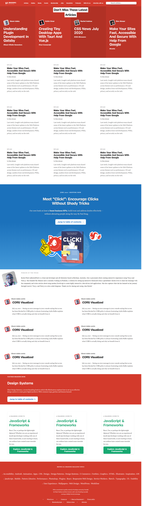

# smashing magazine clone

# PROJECT : Smashing Magazine’s website (Microverse Collaborative Project)

> This project consists on using of plain HTML and CSS to create a website.
> A reproduction of "SMASHING MAGAZINE" website was used to complete the project (https://www.smashingmagazine.com/)

> This project was done with screen resolution of (1920 x 1080), zoom at 100%

#### Techniques used for positioning elements : 

float
grid
flex
background images
gradient

## Built With

- HTML
- CSS

## Live Demo
- [Live Demo Link](https://raw.githack.com/Ahmed-Benj/smashing-magazine-clone/tree/development)

#### Prerequisites
- Browser
- Internet

## Authors

👤 **Ahmed Ben Jmii**

* Ahmed (https://github.com/Ahmed-Benj)
* Linkedin (https://www.linkedin.com/in/ahmed-b-05600992/)

## 🤝 Contributing

Contributions, issues and feature requests are welcome!

Feel free to check them https://github.com/Ahmed-Benj/smashing-magazine-clone/issues.

## Show your support

Give a ⭐️ if you like this project!
